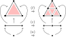
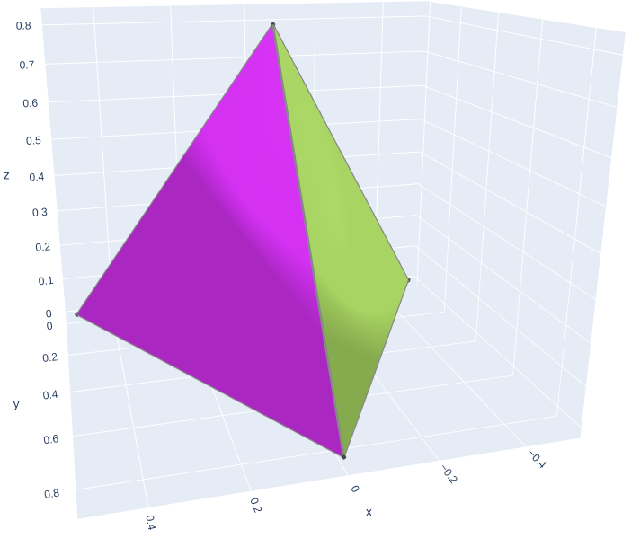
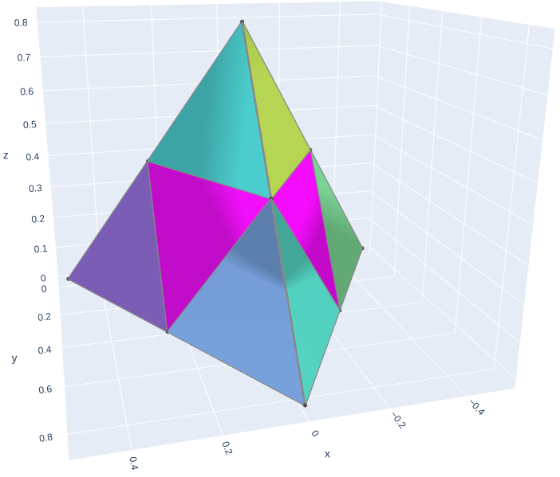
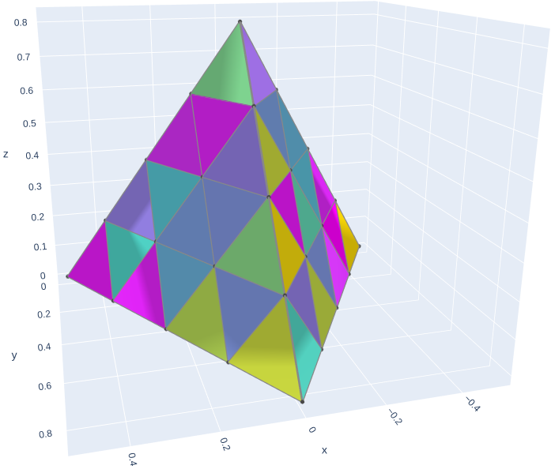
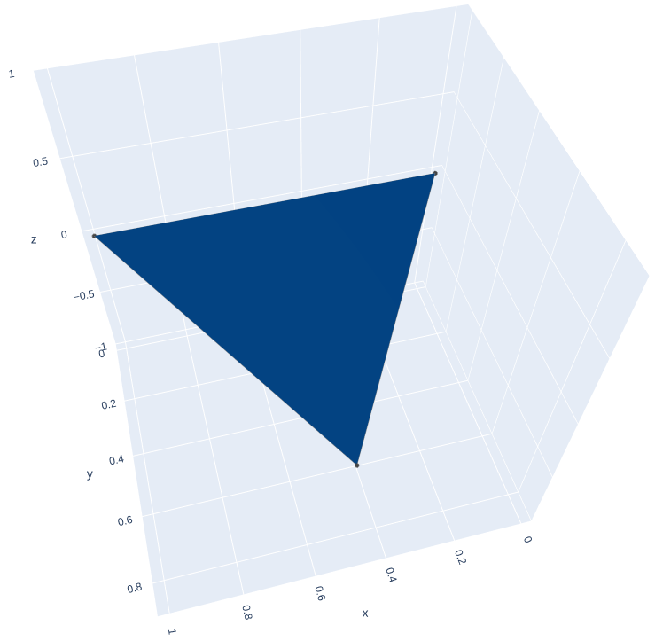
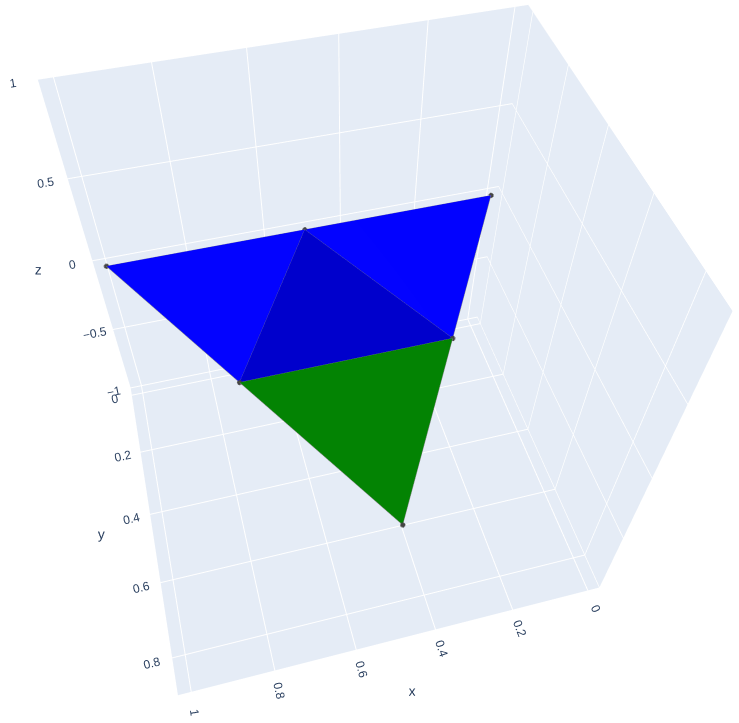
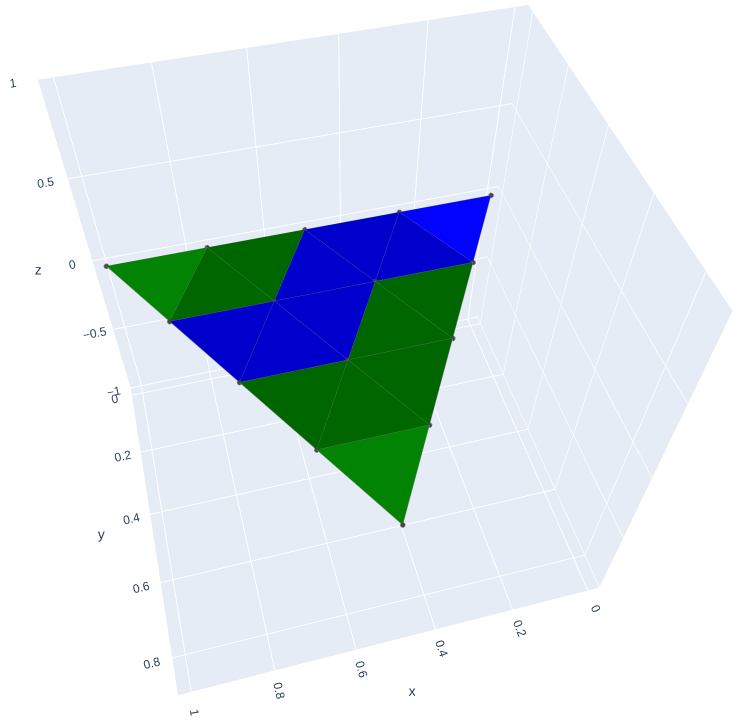
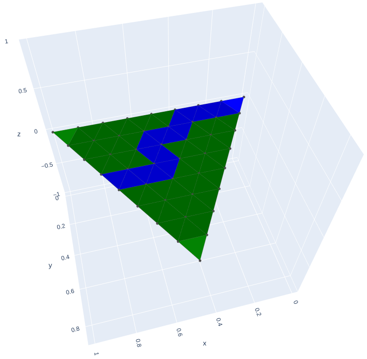
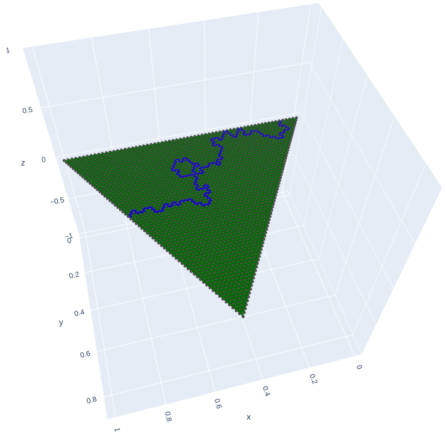
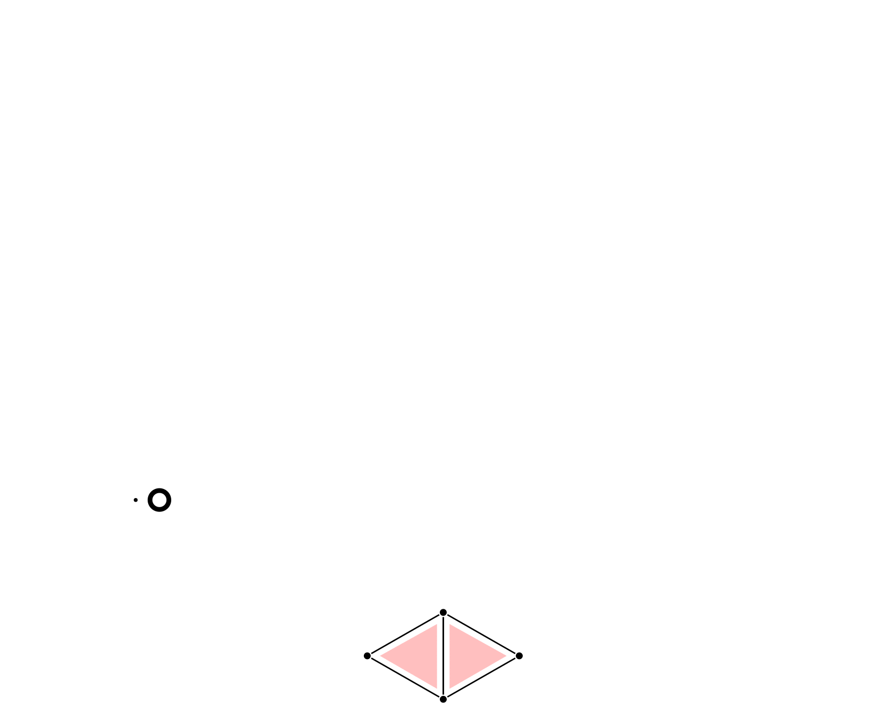

# Global Transformation library

A library to define and compute synchronous rewriting systems as global transformations (GT) <a href="#ref1"><a href="#ref1">[1]</a></a>.

This projects implements the computation algorithm designed in <a href="#ref3">[3]</a>.

It allows to define rewriting systems over the following structures :
- Graphs defined in `data/Graph`
- Generalized maps defined in `data/Gmap`
- Sequences defined in `data/Sequence`
- Labelized structures with `data/Sheaf`
- Sets of alternatives with `data/Open`

To install the required modules :
```pip install -r requirements.txt```

## How does it work ?
Global transformations are formal tools to define synchronous rewriting of various structures. They are based on the mathematical concept of Kan extensions <a href="#ref2">[2]</a>.

For instance, consider this rule system over words <a href="#ref1">[1]</a>:
<p align="center">
    
<p>

When applied on `a`, gives rise to this stream of words: `a, ab, aba, abaab, ...`

We can apply the same kind of rewriting over other structures such as cellulaur automata <a href="#ref2">[2]</a> or graph <a href="#ref3">[3]</a>. See this example over 3d meshes <a href="#ref3">[3]</a>:
<p align="center">
    
<p>
Which gives rise to the following stream of meshes:
<p align="center">
    
    
    
    ...
<p>

It is also possible to non-deterministic choices. The following meshes are outputs for a fractal river generation algorithm <a href="#ref5">[5]</a> (rules can be found in <a href="#ref4">[4]</a>):
<p align="center">
    
    
    
    ...
    
    ...
<p>

The algorithm implented here is presented in details in <a href="#ref3">[3]</a>. See this animation of its computation of the mesh refinement presented above :
<p align="center">
    
</p>
<div align="center">Input is below, output is above.</div>

## Running the tests
The tests in `test` can be run with the following arguments :
- `--show`    : show each step of computation
- `--showall` : show also each intermediary step

Rewriting systems can be run and plotted for visual output in `test\plot`.
Python files in 'test\plot' outputs the following computations:
- graph_tmr: implementation of triangle mesh refinement (TMR) over graphs <a href="#ref1">[1]</a>.
- gmap_tmr: 3D implementation of TMR over generalized maps.
- graph_sierpinsky: modification of the TMR over graphs to compute sierpinksy graphs.
- open_sierpinsky: application of monadic formalism presented in <a href="#ref3">[3]</a> to random subdivision.
- open_rivers: use of previous features for fractal river generation (<a href="#ref3">[3]</a>, <a href="#ref4">[4]</a>).

All theses plots can be run step-by-step by running `jupyter` in `test\plot\jupyter`.
Details of configuration can be found `test\plot\README.md`.

## References:

<ol>

<li> <span id="ref1">My thesis (<a href="https://alexandre-fernandez-dev.github.io/thesis.pdf#chapter.2">chapter 2</a>). Also in the following article:
<br>Fernandez Alexandre, Maignan, Luidnel, Spicher Antoine. “Lindenmayer systems and global transformations.” International Conference on Unconventional Computation and Natural Computation (UCNC 2019) (pp. 65-78). Springer, Cham, 2019.
</span>
</li>

<li> <span id="ref2"> My thesis (<a href="https://alexandre-fernandez-dev.github.io/thesis.pdf#chapter.3">chapter 3</a>). Also in the following article:
<br>Fernandez Alexandre, Luidnel Maignan and Antoine Spicher. “Cellular automata and Kan extensions.” 27th IFIP WG 1.5 International Workshop on Cellular Automata and Discrete Complex Systems (AUTOMATA 2021) (pp. 7:1-7:12). Schloss Dagstuhl -Leibniz-Zentrum fr Informatik, 2021.
</span>
</li>

<li> <span id="ref3"> My thesis (<a href="https://alexandre-fernandez-dev.github.io/thesis.pdf#chapter.4">chapter 4</a>). Also in the following article:
<br>Fernandez Alexandre, Luidnel Maignan and Antoine Spicher. “Accretive Computation of Global Transformations.” International Conference on Relational and Algebraic Methods in Computer Science (RAMiCS 2021) (pp. 159-175). Springer, Cham, 2021.
</span>
</li>

<li> <span id="ref4"> My thesis (<a href="https://alexandre-fernandez-dev.github.io/thesis.pdf#chapter.5">chapter 5</a>). Also in the following article:
<br>Fernandez Alexandre, Luidnel Maignan and Antoine Spicher. “Non-Determinism in Lindenmayer Systems and Global Transformations.” 47th International Symposium on Mathematical Foundations of Computer Science (MFCS 2022) (pp. 49:1-49:13). Schloss Dagstuhl-Leibniz-Zentrum für Informatik, 2022.
</span>
</li>

<li> <span id="ref5"> Prusinkiewicz, Przemyslaw, and Mark Hammel. "A fractal model of mountains and rivers." Graphics Interface. Vol. 93. Canadian Information Processing Society, 1993.
</span>
</li>

</ol>